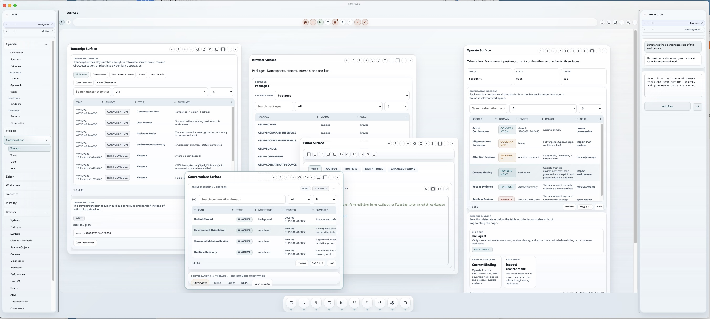

# Desktop Tour

The `Surface` shell is organized around a stable frame:

- a full-width shell header
- a left rail
- a central workspace canvas
- a right rail
- a compact footer status dock

Here is the current desktop shell in its multi-surface form:

## Shell Header

The header identifies the product and keeps shell continuity visible across workspace changes.

It is not where workspace-local operations happen.

## Left Rail

The left rail hosts docked shell panels.

Today that usually means:

- a navigation panel
- utility panels that stay docked beside navigation instead of being forced into the main canvas

Docked panels are presented as a compact, scrollable selectable list at the top of the rail. The active entry determines which rail panel body is visible.

Top-level workspaces:

- Operate
- Projects
- Conversations
- Browser
- Execution
- Recovery
- Evidence
- Configuration

The navigation surface itself is still hierarchical. Top-level areas expand to show subpages, which lets the desktop keep one navigation system instead of duplicating submenus inside the canvas.

The left rail can also be:

- collapsed
- re-expanded
- resized with the splitter
- used as a docking target for floating shell panels

## Workspace Canvas

The center canvas is where you do actual work.

The current information architecture follows one main rule:

- primary table or primary execution surface first
- selected-row detail or result directly below
- secondary summary and helper context after that

This keeps the main working surface at the top of the page instead of burying it under dashboard panels.

`Surface` is designed to support one working sequence:

1. orient to the environment
2. inspect the active project, live system, or conversation state
3. act through browser, listener, or governed workflow
4. review evidence, incidents, readiness, or closure posture

That sequence is intentional. `Surface` is trying to reduce the gap between inspection, action, and proof.

## Right Rail

The right rail is the secondary-context rail.

It usually hosts:

- the workspace inspector
- editor-symbol and related context panels

Like the left rail, it supports:

- multiple docked panels
- compact selectable rail entries
- collapse and re-expand
- resize through the splitter
- redocking of floating shell panels

The right rail should help you keep orientation, but it should not replace the main workspace surface.

## Floating Panels

Undocked rail panels no longer fall into a dock at the bottom of `Surface`.

When you undock a panel, it becomes a floating window in the central desktop stage. That window keeps explicit actions for docking back into:

- the left rail
- the right rail

This keeps docking behavior visible and consistent with the multitasking shell model.

## Splitters

The shell has left and right splitters between the rails and the main canvas.

Those splitters allow you to:

- expand a rail
- contract a rail
- preserve a more comfortable working width for dense panels

Rail width is part of the shell experience, not a cosmetic afterthought.

## Footer

The footer carries compact shell-level status:

- host posture
- binding posture
- current workspace
- runtime state
- workflow state

It is intentionally short so the navigation rail can focus on navigation rather than shell status.

## How To Read The UI

When you enter a workspace, expect:

1. a primary surface at the top
2. selected detail below it
3. secondary context lower in the page

If the page feels like a dashboard with multiple competing first-row panels, that is usually a bug or a regression from the intended UX model.
