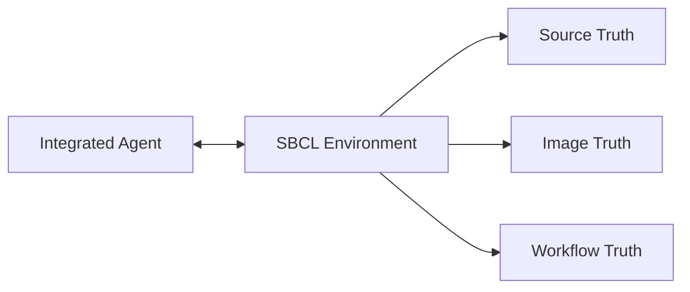
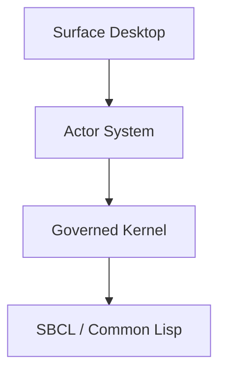
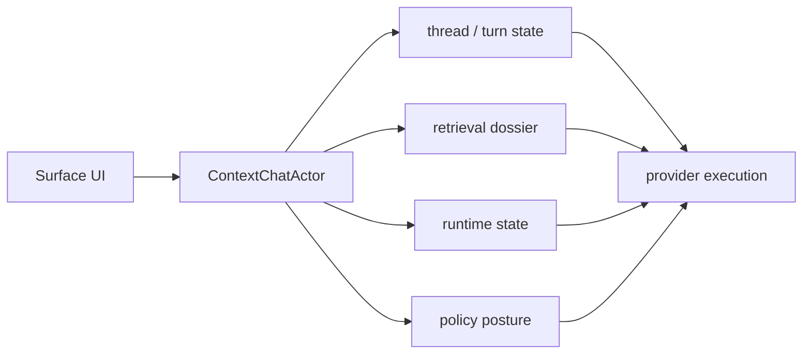
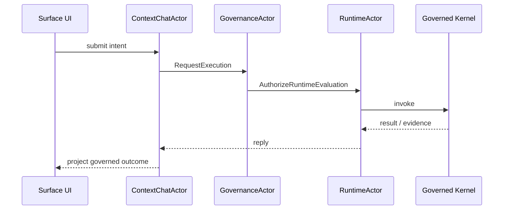

# Technical Architecture

## Purpose

This document defines the technical architecture for the `Surface` application.

It should now be read together with `desktop-shell-and-control-panel-model.md`, which distinguishes the future desktop shell from the currently implemented control-panel application.

The architecture must support:

- a desktop-native macOS application initially
- future Windows portability
- strong alignment with the `sbcl-agent` environment and service model
- separation between product architecture and platform-specific implementation details

## Architecture Goals

The technical architecture must:

- keep `sbcl-agent` as the source of durable domain truth
- avoid embedding business logic or governance rules in UI code
- support live event-driven desktop behavior
- support many concurrent active threads, turns, tasks, and actors
- remain portable across desktop operating systems
- preserve desktop-native quality and responsiveness

## Top-Level Architecture

The system should be organized into four layers:

1. `sbcl-agent` environment kernel
2. `sbcl-agent` public service interface layer
3. Electron application for `Surface` core
4. platform adaptation layer

### Realtime Introspective Environment Architecture

Before breaking the desktop into services and adaptation layers, it helps to name the deeper architectural boundary: `Surface` is not hosting a remote agent that acts on an external target. It is projecting one live environment whose runtime, agent, memory, governance, and UI state are all introspectively available inside the same execution world.

### Execution Kernel Architecture

The kernel diagram below shows the architectural center that Surface is hosting: one environment, an execution kernel organized around `invoke`, `inspect`, and `control`, and a stable service boundary consumed by the desktop and other clients.

### Conversational Context Architecture

The following diagram shows how Surface assembles context for a conversation turn from the current UI state, the live SBCL environment, transcript history, and deliberate operator memory before provider execution.

For the federated employee/contractor node model, the desktop is additionally locked to a strict boundary:

- it remains a pure client of `sbcl-agent`
- it does not call `RGP` directly in the first pass
- federated node posture must be surfaced through local `sbcl-agent` service DTOs

That boundary is defined more explicitly in `eng-docs/federated-workspace-service-boundary.md`.

## Layer 1: Environment Kernel

This remains in `sbcl-agent`.

It owns:

- environment authority
- runtime state
- conversation state
- workflow state
- artifact state
- incident state
- task and worker state
- policy and approval state
- canonical event evidence

## Layer 2: Public Service Interface Layer

This is the required stable boundary between `sbcl-agent` and Surface.

It should expose:

- environment service
- conversation service
- runtime service
- workflow service
- artifact service
- incident service
- task service
- approval service
- event stream service

## Layer 3: Electron Desktop Application Core

This is the product-specific application layer shared across platforms.

It should own:

- shell navigation state
- application launch and selection state
- workspace composition
- view models
- event subscription coordination
- multi-context orchestration
- local desktop persistence for non-authoritative UI state
- design-system implementation
- command routing to public services

This layer should be as platform-neutral as reasonably possible, while being concretely split into:

- Electron main process
- preload bridge
- renderer presentation layer

This layer should no longer be modeled as only one monolithic application UI. It should evolve into:

- desktop-shell behavior
- hosted-application behavior
- shared shell services such as inspector, display routing, and object switching

## Layer 4: Platform Adaptation Layer

This layer handles operating-system-specific behavior.

Examples:

- windowing conventions
- menu integration
- keyboard shortcut conventions
- native accessibility integration
- platform-specific chrome behavior
- packaging and distribution

This layer should be deliberately thin.

## Portability Strategy

The product is macOS-first, but the architecture must avoid a Mac-only trap.

### Rule 1: Product Logic Must Be Cross-Platform

The product model, domain interactions, and application-state logic should not depend on macOS frameworks directly.

### Rule 2: Platform Integration Must Be Isolated

Anything that differs materially between macOS and Windows should live behind platform adaptation seams.

### Rule 3: Design System Must Be Token-Driven

Visual tokens, semantic states, and component roles must be portable even if low-level control rendering differs later.

### Rule 4: Service Access Must Be Platform-Agnostic

Surface’s connection to `sbcl-agent` must use a transport and protocol strategy that can work on both macOS and Windows.

## Recommended Application Shape

Surface should have these internal modules:

- desktop shell module
- hosted application module
- navigation module
- workspace module
- entity view module
- inspector module
- command and direct evaluation module
- event subscription module
- concurrency and attention orchestration module
- local persistence module
- design system module
- platform adapter module

The current operational workspace should become the initial hosted application: the control panel.

Recommended Electron ownership:

- main process: transport, event subscription, platform integration, app lifecycle
- preload: typed secure bridge
- renderer: workspaces, entity views, inspectors, visual composition

## Data Flow Model

### Query Flow

1. User opens a workspace or entity.
2. App core issues queries to the relevant service family.
3. Service returns stable DTOs.
4. App core derives view state.
5. UI renders using design-system components.

### Command Flow

1. User invokes a governed action.
2. App core issues a service command.
3. Service returns:
   - accepted
   - awaiting approval
   - rejected
4. Event stream updates the affected entities.
5. App core refreshes local view state.

## Governance Architecture

The governance model is not an after-the-fact audit lane. It is part of the execution architecture itself, linking policy, approval, validation, incidents, evidence, and recovery to the same environment and operator surfaces.

The canonical architecture references now live in the main repository docs:

- [`sbcl-agent` architecture](../../sbcl-agent/docs/architecture.md)
- [`sbcl-agent` actor runtime](../../sbcl-agent/docs/robust-actor-kernel-architecture.md)
- [`sbcl-agent` actor system surface](../../sbcl-agent/docs/actor-system-panel.md)

### Event Flow

1. App subscribes or polls through the event stream contract.
2. Event subscription module normalizes incoming service events.
3. App core updates relevant view models.
4. Attention and workspace state update accordingly.

## State Management Rules

The app must distinguish sharply between:

- authoritative domain state
- derived view state
- local UI state

### Authoritative Domain State

Lives in `sbcl-agent`.

Examples:

- turn status
- incident status
- workflow posture
- approval status

### Derived View State

Built in Surface from service DTOs and event streams.

Examples:

- selected workspace presentation model
- grouped activity lists
- summarized attention panels
- thread supervision summaries
- actor supervision summaries

### Local UI State

Desktop-local and non-authoritative.

Examples:

- panel open or closed state
- local sort preference
- pinned inspector
- window geometry

## Eventing Architecture

Surface should be designed around the environment event stream contract already implied by `sbcl-agent`.

Required capabilities:

- environment-scoped cursoring
- family filters
- bounded replay
- live refresh semantics
- resilient reconnect behavior

The app should also support efficient fan-out of event effects into:

- thread state summaries
- attention aggregation
- actor activity summaries
- workspace-local derived state

In Electron, canonical event intake should terminate in the main process first, then flow into renderers through explicit bridge channels.

## Desktop Runtime Integration

Surface will need a runtime integration strategy for talking to `sbcl-agent`.

The architecture should support a local integration mode where the app communicates with a locally running `sbcl-agent` service boundary.

The exact transport is not finalized here, but it must satisfy:

- cross-platform viability
- local security clarity
- low-latency request and event handling
- support for long-lived sessions
- support for sustained concurrent activity across many threads and actors

In Electron, the renderer must not own raw transport connectivity to `sbcl-agent`.

## macOS-First, Windows-Later Implications

### macOS First

The first implementation may take advantage of:

- strong native desktop conventions
- Mac keyboard and menu affordances
- Mac windowing expectations

### Windows Later

The future Windows port will require:

- platform-appropriate command and shortcut mapping
- platform-specific window chrome and shell integration
- potentially different installer and packaging paths

None of those should require:

- rewriting the product model
- rethinking service boundaries
- reclassifying domain entities
- redesigning the design token model

## Architecture Anti-Patterns

The technical architecture must avoid:

- embedding governance rules in view code
- reading private shell or compatibility-session state directly
- coupling the product model to macOS-only UI APIs
- implementing event meaning in the renderer instead of the service boundary
- allowing local UI persistence to become a competing truth source
- allowing the renderer to become the hidden product authority
- letting browser navigation metaphors define the application

## Acceptance Criteria

The technical architecture is acceptable when:

1. `sbcl-agent` remains the authority for durable domain state
2. Surface can be implemented as a serious macOS application without violating service-boundary rules
3. platform-specific code is isolated behind clear adaptation seams
4. a future Windows port would mostly replace the platform layer rather than the product core
5. the architecture preserves live event-driven behavior and governed execution semantics
